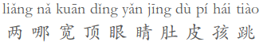
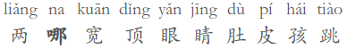
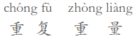

# hexo-ruby-character #

[](https://npmjs.org/package/hexo-ruby-character) 
[](https://npmjs.org/package/hexo-ruby-character)
[](https://npmjs.org/package/hexo-ruby-character)
[](https://npmjs.org/package/hexo-ruby-character)

Ruby character tag for Hexo, inspired by the [Ruby template](http://zh.moegirl.org/Template:Ruby) of [萌娘百科](http://zh.moegirl.org).

## Install ##

1. Install g++
```
apt-get install g++
```
2. install node module

```
npm install hexo-ruby-character --save
```

## Usage ##

`` → <ruby>Base<rp> (</rp><rt>top</rt><rp>) </rp></ruby>

Specifically, if the top field is in Chinese characters, it while be converted to Chinese pinyin, because the pinyin chatater with heads are not easy to type.

Followings are the examples.

`` → <ruby>两哪宽顶眼睛肚皮孩跳<rp> (</rp><rt>liǎng nǎ kuān dǐng yǎn jīng dù pí hái tiào</rt><rp>) </rp></ruby>



`` → <ruby> 两<rp> (</rp><rt>liǎng</rt><rp>) </rp></ruby><ruby><strong>哪</strong><rp> (</rp><rt>nǎ</rt><rp>) </rp></ruby><ruby>宽<rp> (</rp><rt>kuān</rt><rp>) </rp></ruby><ruby>顶<rp> (</rp><rt>dǐng</rt><rp>) </rp></ruby><ruby>眼<rp> (</rp><rt>yǎn</rt><rp>) </rp></ruby><ruby>睛<rp> (</rp><rt>jīng</rt><rp>) </rp></ruby><ruby>肚<rp> (</rp><rt>dù</rt><rp>) </rp></ruby><ruby>皮<rp> (</rp><rt>pí</rt><rp>) </rp></ruby><ruby>孩<rp> (</rp><rt>hái</rt><rp>) </rp></ruby><ruby>跳<rp> (</rp><rt>tiào</rt><rp>) </rp></ruby>



`` → <ruby>重复<rp> (</rp><rt>chóng fù</rt><rp>) </rp></ruby><ruby>重量<rp> (</rp><rt> zhòng liàng</rt><rp>) </rp></ruby>



Other languages like Japanese is also supported.

`` → <ruby>超電磁砲<rp> (</rp><rt>レールガン</rt><rp>) </rp></ruby>

## Known issues ##

